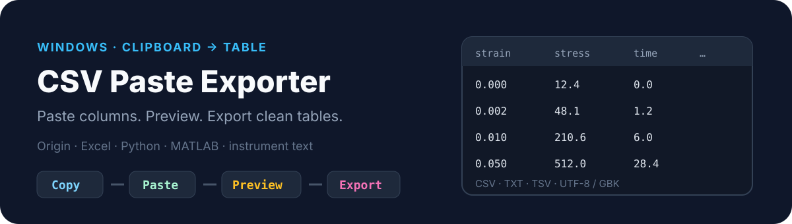

<p align="center">
  
</p>

# CSV Paste Exporter

**Paste columns. Preview. Export clean tables for Origin, Excel, Python, and MATLAB.**

A lightweight Windows tool for researchers and engineers who move experimental data between instrument software, Origin, Excel, and scripts — without hand-editing delimiters.

中文：从 Origin / Excel / 仪器软件复制若干列 → 粘贴 → 预览 → 导出 CSV / TXT / TSV。

<p align="center">
  
</p>

```text
Copy columns  →  Paste  →  Preview  →  Export
```

Typical uses: tensile stress–strain columns, XRD `2theta`/intensity pairs, spectroscopy tables, wide Origin worksheets split for plotting scripts.

### Capabilities

- Auto-detect tab, comma, semicolon, or whitespace  
- Remove empty rows/columns; pad uneven rows  
- Preserve headers, units, scientific notation, original text  
- Column delete/reorder; restore original parse  
- Quick X/Y chart preview · export readiness check  
- Target presets: Excel, Origin, Python/pandas, MATLAB, GBK instruments  
- Encoding: UTF-8 BOM, UTF-8, GBK  

### Format guide

| Target | Format | Encoding |
| --- | --- | --- |
| Excel (Windows) | CSV | UTF-8 BOM |
| Python / pandas | CSV or TSV | UTF-8 |
| Origin | TXT (tab) | UTF-8 BOM or GBK |
| MATLAB / R | CSV or TSV | UTF-8 |

<p align="center">
  
</p>

## Download

**[Latest Release](https://github.com/D-sudoasd/csv-paste-exporter/releases/latest)** — e.g. `CSV-Paste-Exporter-Windows-v0.2.0.exe`. No Python required for the release build.

1. Double-click the EXE  
2. Copy columns from Origin / Excel / instrument software  
3. **粘贴剪贴板** → check preview → choose format → **导出**

## Develop from source

Runtime is stdlib-only:

```powershell
py csv_paste_exporter.py
py -m pytest -q
```

Build EXE: see `requirements-dev.txt` + PyInstaller one-file windowed build in project docs/history.

## License

MIT — see [LICENSE](LICENSE).
